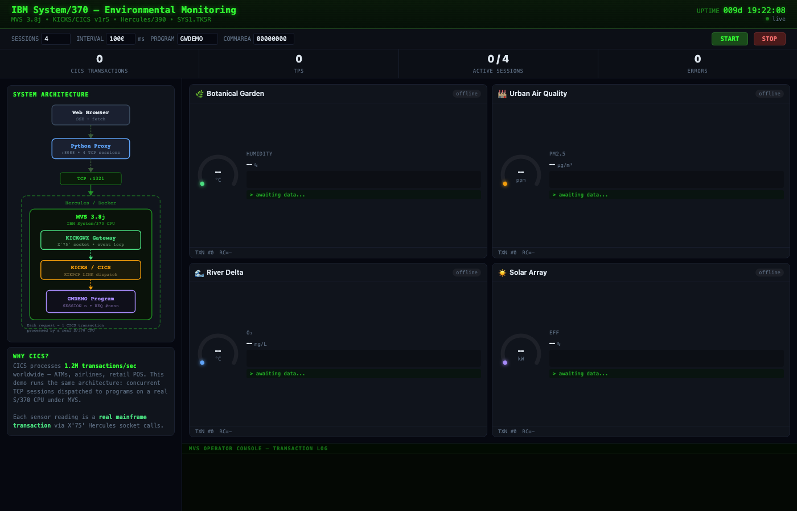
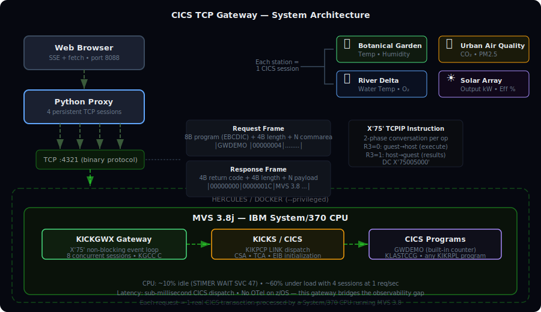

# CICS TCP Gateway for Hercules/MVS

A TCP gateway that executes real CICS transactions on an IBM System/370
mainframe emulated with [Hercules](http://www.hercules-390.eu/), running
MVS 3.8j and [KICKS](http://kicksfortso.com/) (open-source CICS).
Includes a real-time web dashboard that visualizes the mainframe processing
live sensor data.

### Dashboard idle — architecture diagram and 4 sensor stations awaiting data



### Dashboard live — 4 concurrent CICS sessions streaming real transactions


Every data point on the dashboard is a **real CICS transaction** processed
by an emulated System/370 CPU. The gateway accepts concurrent persistent TCP
sessions, dispatches requests to CICS programs via `KIKPCP LINK`, and
returns EBCDIC responses — the same model that processes 1.2 million
transactions per second worldwide (ATMs, airlines, retail POS).

## What is CICS and why does it matter?

[CICS](https://www.ibm.com/products/cics-transaction-server) (Customer
Information Control System) is IBM's transaction processing monitor, first
released in 1969. It runs the world's highest-volume transactional
workloads: **92 of the top 100 banks**, most major airlines, insurance
companies, and retail chains depend on CICS. IBM reports over **1.2 million
CICS transactions per second** across its installed base — more than any
other transaction platform.

CICS provides what modern architectures struggle to replicate:

- **Single address space, multiple concurrent transactions** — thousands of
  programs share memory and dispatch serially or in parallel under one
  monitor. No network hops between services, no serialization overhead, no
  distributed tracing needed. A CICS `LINK` to another program is a local
  function call, not an HTTP request.
- **ACID guarantees built in** — two-phase commit across VSAM files, DB2,
  MQ, and IMS in a single unit of work. No eventual consistency, no saga
  patterns, no compensation logic.
- **Sub-millisecond latency** — a typical CICS transaction completes in
  0.1–2ms. The equivalent microservice chain (API gateway → auth service →
  business logic → database → response aggregation) adds 10–50ms of network
  and serialization overhead per hop.

### The microservices trade-off

When organizations modernize CICS applications, the standard approach is
decomposition into microservices. A single CICS transaction that did
`LINK PGMA → LINK PGMB → LINK PGMC` becomes three HTTP services with
JSON serialization, service discovery, circuit breakers, retry logic, and
distributed tracing.

**What you gain**: independent deployment, team autonomy, horizontal
scaling, technology diversity.

**What you lose**:

| Concern | CICS monolith | Microservices |
|---------|--------------|---------------|
| Latency per inter-service call | ~0 (in-process LINK) | 1–10ms (HTTP/gRPC) |
| Transaction consistency | Built-in 2PC | Sagas, eventual consistency |
| Observability | SMF records, CICS statistics | Distributed tracing (Jaeger/Zipkin) |
| Failure modes | Process crash = all or nothing | Partial failure, cascading timeouts |
| Operational complexity | One region to monitor | N services × M instances |
| Data coherence | Shared VSAM/DB2 | Database-per-service, sync challenges |

A 5-hop microservice call chain at 3ms per hop adds 15ms of pure network
latency that simply doesn't exist in CICS. For high-frequency trading,
real-time payments, or airline reservation systems, this overhead is
unacceptable — which is why CICS still runs these workloads.

### The observability gap on the host

The biggest operational pain point with mainframe CICS is **lack of modern
observability**. Distributed systems have mature tooling — OpenTelemetry,
Prometheus, Grafana, Datadog — that provides traces, metrics, and logs
with microsecond granularity.

Mainframe CICS has none of this:

- **SMF records** (System Management Facility) are the primary telemetry
  source. They're batch-oriented, written to sequential datasets, and
  typically processed hours or days later. No real-time streaming.
- **CICS statistics** are available via `EXEC CICS COLLECT STATISTICS`, but
  the data stays on the host. Getting it out requires SNA/LU6.2, MQ, or
  custom TCP programs — exactly what this project demonstrates.
- **No OpenTelemetry on z/OS** — the OTel SDK requires a modern runtime
  (Java 8+, .NET, Python, Go). CICS programs are written in COBOL, PL/I,
  or assembler. There is no OTel SDK for COBOL. Even for CICS Java programs
  (JVMServer), the z/OS JVM has limited OTel support and the overhead of
  tracing in a high-throughput transaction monitor is considered too risky
  for production workloads.
- **Vendor agents** (Dynatrace, Datadog, Instana) can instrument CICS
  TS v5+ on z/OS, but they require IBM-specific APIs (CICS Monitoring
  Facility, z/OS System Logger), cost significant MIPS, and add latency to
  every transaction. Most shops refuse to run them in production.
- **The data stays trapped** — even when telemetry exists, it lives in
  EBCDIC on DASD. Correlating a CICS transaction with a downstream REST
  call requires manual effort: match the CICS task number in SMF 110
  records with the trace ID in Jaeger. No tool does this automatically.

This is the fundamental tension: the platform that processes the most
critical transactions in the world has the least visibility into what's
happening inside it.

### What this project demonstrates

This gateway is a proof of concept for **bridging the observability gap**.
By exposing CICS transactions over TCP with a web dashboard, we get:

- **Real-time streaming** — every transaction is visible the moment it
  completes, not hours later in an SMF dump
- **Standard protocols** — SSE/HTTP, not SNA/LU6.2
- **Correlation potential** — the gateway could inject trace IDs into the
  commarea, creating a bridge between distributed traces and CICS
  transaction IDs
- **Zero MIPS overhead for monitoring** — the gateway runs as a single
  MVS batch job; the heavy lifting (UI, aggregation, alerting) happens
  off-host

The environmental monitoring demo is a visual metaphor: each sensor station
is a CICS session, and the dashboard is the observability layer that
mainframe teams have always wanted.

## How we built it

This project was built bottom-up, from raw S/370 assembler to a web
dashboard, each step verified on the emulated mainframe.

### Step 1: Can MVS open a TCP socket?

The first question was whether we could make MVS create a TCP socket at all.
Hercules provides a special instruction `X'75'` (TCPIP) that bridges the
guest OS to the host network stack. But it's not a simple syscall — each
socket operation requires a **two-phase conversation**:

```asm
* Phase 1: guest-to-host — allocate conversation, copy input, execute
         SR    0,0            clear R0 (phase 0)
         SR    3,3            R3=0 means guest-to-host
         DC    X'75005000'    execute TCPIP instruction
         LR    6,14           save conversation ID from R14

* Phase 2: host-to-guest — retrieve results, free conversation
         LR    14,6           restore conversation ID
         SR    0,0
         LA    3,1            R3=1 means host-to-guest
         DC    X'75005000'    execute TCPIP instruction
         LR    15,4           return code in R4
```

The register convention: R7 = function code (1=INITAPI, 5=SOCKET, 6=BIND,
8=LISTEN, 9=ACCEPT, 10=SEND, 11=RECV, 12=CLOSE), R8/R9 = auxiliary
parameters, R4 = return code.

`src/CICSGW.asm` implements the full socket lifecycle in pure S/370 assembler:
INITAPI → SOCKET(AF_INET, SOCK_STREAM) → BIND(0.0.0.0:4321) → LISTEN(5) →
ACCEPT → RECV → SEND → CLOSE. No C runtime, no external libraries.

**Result**: MVS creates a TCP socket, binds port 4321, and responds to
clients. Verified with `IFOX00 RC=0000` (assembler) and `IEWL RC=0000`
(linkage editor).

### Step 2: Can KICKS dispatch a program?

KICKS is an open-source CICS clone. The dispatch mechanism is:
```c
KIKPCP(csa, kikpcpLINK, program, commarea, &len);
```

But KICKS requires heavy initialization first — the same sequence that
`KIKSIP1$` performs at CICS startup:

1. Initialize CSA (Common Storage Area) with eyecatchers and version fields
2. Load system tables: `KIKSIT`, `KIKPPT`, `KIKPCT`, `KIKFCT`, `KIKDCT`
3. Load control programs: `KIKPCP`, `KIKKCP`, `KIKFCP`, `KIKDCP`, `KIKTCP`,
   `KIKSCP`, `KIKTSP`
4. Initialize each control program with its INIT call
5. Create TCA (Task Control Area) and TCTTE for each request
6. Set up EIB (Executive Interface Block) with task number, terminal ID,
   transaction ID

`src/KICKGW.c` implements the dispatch guard. Compiled with KGCC (KICKS's
GCC-derived C compiler for S/370).

**Result**: `KICKGW` compiles, links, and runs with `RC=0000`. KICKS
dispatch works.

### Step 3: Combine TCP + KICKS in one program

`src/KICKGWX.c` merges the X'75' TCP handling with KICKS dispatch. But
calling X'75' from C requires a bridge — `src/X75CALL.asm` provides a
callable assembler wrapper:

```c
int x75call(int func, int aux1, int aux2, char *buf, int len, int mode);
// mode 0: no payload, mode 1: SEND from buf, mode 2: RECV into buf
```

The JCL pipeline (`jcl/KICKGWX.jcl`):
1. Assemble `X75CALL.asm` with `IFOX00`
2. Compile `KICKGWX.c` with `GCC370` (KGCC)
3. Link both with KICKS libraries (`KIKASRB`, `KIKLOAD`, `VCONSTB5`)
4. Run as `PGM=KICKGWX,PARM='4321'`

**Result**: TCP request to `KLASTCCG` returns `rc=0, length=4, commarea
modified`. Multiple frames on the same socket work. Session-persistent
connections verified.

### Step 4: Can X'75' ACCEPT be non-blocking?

This was the key discovery. The gateway was sequential: accept one client,
handle requests, close, accept next. We hypothesized that X'75' ACCEPT
might be non-blocking like RECV (which returns -2 when no data is pending).

**It is.** X'75' ACCEPT returns a negative value immediately when no
connection is pending. This means we can build a **reactor-style event loop**
inside a single MVS address space:

```c
while (1) {
    /* non-blocking accept */
    fd = x75call(9, lsnfd, 0, 0, 0, 0);
    if (fd >= 0) session_add(fd);

    /* poll all sessions */
    did_work = 0;
    for (i = 0; i < MAX_SESSIONS; i++) {
        if (sessions[i].state != SS_FREE)
            did_work = did_work + session_poll(&sessions[i]);
    }

    /* yield CPU when idle */
    if (did_work == 0) stimwt(1);  /* 10ms sleep via SVC 47 */
}
```

Each session has a state machine: `SS_RDHDR` → `SS_RDDATA` → dispatch →
repeat. Socket I/O is multiplexed across all sessions; KICKS dispatch is
serialized (KICKS globals are not reentrant).

**Result**: 4 simultaneous persistent sessions, each with multiple
request/response cycles, all returning `rc=0`. Same architecture as
Node.js or nginx workers — but running on a 1970s operating system.

### Step 5: STIMER WAIT — proper CPU yield

The event loop was busy-polling at 100% CPU. MVS provides `STIMER WAIT`
(SVC 47) for cooperative multitasking. We wrote a C-callable wrapper in
assembler:

```asm
STIMWT   CSECT
         ...
         STIMER WAIT,BINTVL=SVINTV    sleep for N centiseconds
         ...
SVINTV   DC    F'1'                   1 centisecond = 10ms
```

**Result**: CPU drops from 100% to ~10% idle, ~60% under load with 4
sessions. All sessions still respond correctly.

### Step 6: GWDEMO built-in handler

For demos without requiring CICS programs, the gateway recognizes program
name `GWDEMO` and responds directly:

```c
sprintf(s->req, "MVS 3.8 SESSION %d  REQ #%04d", s->sid, s->seq);
```

Each session has its own counter, making concurrent operation visually
obvious.

### Step 7: Web dashboard

`src/cics_web_sessions.py` is a pure-stdlib Python web server that:
- Opens N independent persistent TCP sockets to the CICS backend
- Sends requests at configurable intervals
- Decodes EBCDIC responses (codepage 037) to ASCII
- Streams everything as Server-Sent Events

The Environmental Monitoring UI transforms GWDEMO counters into simulated
sensor readings using composite sine waves, showing the mainframe as a
central transaction processing hub for environmental data — the same
pattern CICS uses for real-world distributed systems.

### KGCC constraints

Writing C for KGCC (a GCC port to S/370) has unique constraints:

- **No `typedef struct`** — must use `struct gwsess` everywhere
- **No `||` operator** — the pipe character `|` gets mangled by the EBCDIC
  card reader. Use `if (a) {} else if (b) {}` or `(a + b != 0)` instead
- **No UTF-8 in source** — em-dashes, smart quotes, etc. break EBCDIC
  conversion. ASCII-only comments
- **No modern C features** — no variadic macros, no `_Bool`, limited
  `stdlib.h`

## Architecture



## Protocol

Fixed-format binary over TCP. All strings in EBCDIC (codepage 037).

### Request

| Offset | Length | Field           | Description                |
|--------|--------|-----------------|----------------------------|
| 0      | 8      | Program name    | EBCDIC, space-padded       |
| 8      | 4      | Commarea length | Big-endian unsigned 32-bit |
| 12     | N      | Commarea data   | N = commarea length        |

### Response

| Offset | Length | Field         | Description                |
|--------|--------|---------------|----------------------------|
| 0      | 4      | Return code   | Big-endian unsigned 32-bit |
| 4      | 4      | Output length | Big-endian unsigned 32-bit |
| 8      | N      | Output data   | EBCDIC, N = output length  |

## Quick Start

### Prerequisites

- Docker (for the Hercules/MVS mainframe container)
- Python 3.8+ (for the web dashboard — no external dependencies)

### 1. Start the mainframe

```bash
docker run -d --privileged --name hercules-mvs --restart unless-stopped \
  -p 3270:3270 -p 3505:3505 -p 8038:8038 -p 4321:4321 \
  -v docker_mvs-tk5-dasd.usr:/opt/tk5/dasd.usr \
  cics-tcp-gateway/hercules-mvs:with-4321-base
```

`--privileged` is required for Hercules to emulate the S/370 CPU.

### 2. Submit the gateway JCL

```bash
awk '{gsub(/\r/,""); print}' jcl/KICKGWX.jcl | nc localhost 3505
```

This submits a batch job that assembles `X75CALL.asm`, compiles `KICKGWX.c`
with KGCC, links everything with KICKS libraries, and starts the gateway
listening on port 4321 inside MVS.

Check the printer output:
```bash
docker exec hercules-mvs cat /opt/tk5/prt/prt00e.txt | tail -20
```

Expected: `X75ASM RC=0000`, `COMP RC=0000`, `ASM RC=0000`, `LKED RC=0000`.

### 3. Start the web dashboard

```bash
python3 src/cics_web_sessions.py --host 127.0.0.1 --port 8088 \
  --backend 127.0.0.1:4321
```

Open http://127.0.0.1:8088/ and click **START**.

### Docker alternative for the dashboard

```bash
docker build -t cics-tcp-gateway-web .
docker run -p 8088:8088 cics-tcp-gateway-web
```

### Test client

```bash
node test/test-gateway.js --host=localhost --port=4321
```

## Files

### MVS side (S/370 assembler + KGCC C)

| File | Lines | Description |
|------|-------|-------------|
| `src/CICSGW.asm` | ~180 | Pure S/370 assembler TCP listener. The first proof-of-concept: every X'75' operation (INITAPI through CLOSE) hand-coded in assembler. Includes error detection for BIND failures (EADDRINUSE, EAFNOSUPPORT) and a stale socket cleanup routine (CLEANSOC) that closes fds 1-32 on startup to prevent port conflicts from prior runs. |
| `src/KICKGWX.c` | ~700 | The main gateway. Non-blocking event loop multiplexing 8 sessions. Full KICKS initialization (CSA/TCA/EIB/SIT/PPT/PCT/FCT/DCT + 7 control programs). Per-session state machine (RDHDR→RDDATA→dispatch→repeat). Built-in GWDEMO handler. Constrained by KGCC: no `typedef struct`, no `\|\|`, no UTF-8. |
| `src/KICKGW.c` | ~60 | KICKS dispatch guard. Validates commarea length (0–24576), checks CSA/TCA/TCTTE initialization, calls `KIKPCP LINK`. |
| `src/X75CALL.asm` | ~98 | Two functions: `x75call()` wraps the X'75' two-phase conversation for C code. `stimwt()` wraps MVS `STIMER WAIT` (SVC 47) for CPU-friendly idle loops. |
| `src/cicsgw.c` | ~200 | Alternative C implementation using JCC socket wrappers. Requires JCC compiler (not installed in standard TK5). |

### Host side (Python + Node.js)

| File | Lines | Description |
|------|-------|-------------|
| `src/cics_web_sessions.py` | ~810 | Python web server (pure stdlib). ThreadingHTTPServer with SSE. Each session runs in a dedicated thread with its own persistent TCP socket. EventBroker pub/sub for SSE delivery. Environmental Monitoring UI with SVG gauges, canvas sparklines, and operator console. Decodes EBCDIC (cp037) to ASCII. |
| `src/host-gateway.js` | ~220 | Node.js TCP proxy. Mock mode (echo) or proxy mode (round-robin across KICKGWX backend workers). Enables multi-user operation with isolated KICKS state per worker. |

### JCL

| File | Description |
|------|-------------|
| `jcl/ASMCLG.jcl` | Assemble + link + run the basic CICSGW assembler listener |
| `jcl/KICKGW.jcl` | KGCC compile + link for the KICKS dispatch module |
| `jcl/KICKGWX.jcl` | Full build: assemble X75CALL → compile KICKGWX → link with KICKS libs → run. Uses `JOBPROC` pointing to KICKS PROCLIB, `HERC01.KICKSTS.H` includes, and SKIKLOAD/KIKRPL runtime DDs. |

### Test

| File | Description |
|------|-------------|
| `test/test-gateway.js` | Node.js test client with full ASCII↔EBCDIC translation tables (codepage 037). Sends binary protocol frames and validates responses. |

## Configuration

The gateway port is set in JCL: `PARM='4321'`. To change it, also update
the BIND parameter in `CICSGW.asm`:

```asm
BINDPRM  DC    X'000210E1'       AF_INET=2, port 4321 (0x10E1)
```

Port conversion: 8080 = `0x1F90`, 9090 = `0x2382`.

The KGCC build requires these MVS datasets:
- `HERC01.KICKSSYS.V1R5M0.PROCLIB` — KGCC PROC
- `HERC01.KICKSSYS.V1R5M0.SKIKLOAD` — KICKS system modules
- `HERC01.KICKSSYS.V1R5M0.KIKRPL` — CICS program library
- `HERC01.KICKSTS.H` / `HERC01.KICKSTS.TH` — C include files

## Challenges and Solutions

### 100% CPU usage → 10% idle

The first event loop version busy-polled all sockets continuously. On the
Hercules host, the emulated S/370 CPU consumed 100% of a real CPU core even
when idle. The fix was `STIMER WAIT` — MVS's cooperative multitasking
primitive (SVC 47). When no session has work, the loop sleeps for 1
centisecond (10ms), properly yielding the Hercules host CPU.

```c
if (did_work == 0) stimwt(1);  /* 10ms via STIMER WAIT */
```

**Before**: 100% CPU idle, 100% CPU under load.
**After**: ~10% CPU idle, ~60% CPU with 4 active sessions at 1 req/sec.

### X'75' calling convention — the three-phase mistake

The initial assembler tried a 3-phase approach to X'75' (setup/execute/
cleanup). This caused `EADDRINUSE` and `EINVAL` errors because operations
like BIND were being executed twice. The correct convention is exactly
**2 instructions per operation**:

1. R3=0 (guest→host): allocate conversation, copy input buffer, execute
2. R3=1 (host→guest): retrieve results into output buffer, free conversation

The conversation ID returned in R14 from phase 1 must be preserved and
restored before phase 2. Getting this wrong silently corrupts socket state.

### EBCDIC card reader mangles `||`

KGCC compiles C source that arrives via the MVS card reader — which
translates ASCII to EBCDIC. The pipe character `|` (0x7C in ASCII) maps
to a different EBCDIC code point than what the C compiler expects. Any
use of `||` (logical OR) produces garbage.

**Workaround**: Replace `if (a || b)` with `if (a) {} else if (b) {}`
or `if ((a) + (b) != 0)` throughout the codebase.

### No `typedef struct` in KGCC

KGCC's parser doesn't handle `typedef struct`. Every struct must be
declared with a tag and referenced as `struct tagname` everywhere:

```c
/* This fails in KGCC: */
typedef struct { int fd; int state; } session_t;

/* This works: */
struct gwsess { int fd; int state; };
```

### UTF-8 breaks JCL submission

Source code is submitted to MVS via `nc localhost 3505` (the card reader
port). Any non-ASCII character — em-dashes, curly quotes, UTF-8 in
comments — corrupts the EBCDIC conversion and causes assembly or
compilation errors with no obvious diagnostic. All source must be pure
7-bit ASCII.

### BIND errors on restart — stale sockets

When the gateway crashes or is restarted, the previous socket file
descriptors may still be held by Hercules. Attempting to BIND fails with
`EADDRINUSE`. The solution is CLEANSOC — a startup routine that blindly
closes socket fds 1 through 32 before creating a new socket:

```asm
CLEANSOC DS    0H
         LA    7,12            CLOSE function
         LA    8,1             start at fd=1
CLNLOOP  LR    7,8
         SLL   7,16
         OR    7,=F'12'        CLOSE(fd)
         ...
         LA    8,1(8)
         C     8,=F'32'
         BLE   CLNLOOP
```

### KICKS reentrance — serialized dispatch

KICKS stores global state in the CSA (Common Storage Area). Two concurrent
`KIKPCP LINK` calls would corrupt each other. The gateway serializes
dispatch: socket I/O is multiplexed across all 8 sessions, but program
execution happens one request at a time. For true multi-user parallelism,
run multiple KICKGWX processes behind `host-gateway.js` in proxy mode.

### Docker `--privileged` requirement

Hercules emulates a full System/370 CPU, which requires access to host
features that Docker blocks by default. Without `--privileged`, the
container starts but X'75' instructions fail with operation exceptions
(S0C1). There is no workaround — Hercules needs privileged mode.

## Limitations

- Max commarea: 4096 bytes (KICKGWX buffer), 24576 bytes (KICKGW guard)
- KICKS dispatch is serialized — KICKS globals are not reentrant. Socket I/O
  is multiplexed, but program execution is sequential
- No TLS (plaintext TCP). The X'75' instruction does not support SSL
- Requires `--privileged` Docker for Hercules CPU emulation
- Single address space — for true multi-user, run multiple KICKGWX workers
  behind `host-gateway.js` in proxy mode

## License

MIT
