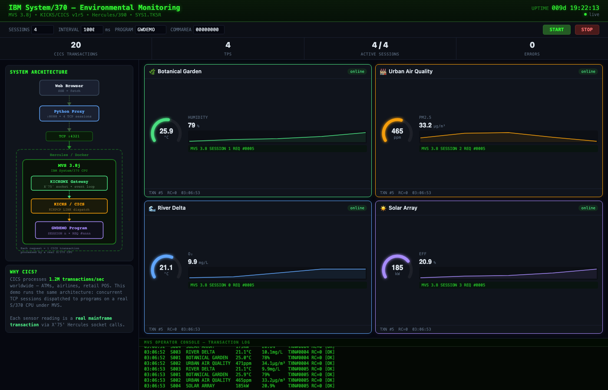

# CICS TCP Gateway for Hercules/MVS

A TCP gateway that executes real CICS transactions on an IBM System/370
mainframe (emulated with Hercules) running MVS 3.8 and KICKS/CICS. Includes
a real-time web dashboard with environmental monitoring demo.



## What is this?

This project connects a modern web browser to a 1970s IBM mainframe operating
system. Every data point on the dashboard is a **real CICS transaction**
processed by an emulated System/370 CPU running MVS 3.8j under
[Hercules](http://www.hercules-390.eu/), using
[KICKS](http://kicksfortso.com/) (an open-source CICS clone).

The gateway program (`KICKGWX`) runs inside MVS and accepts TCP connections
using the Hercules X'75' TCPIP instruction. It multiplexes up to 8 concurrent
persistent sessions in a single-threaded event loop (same model as Node.js or
nginx workers), dispatching each request to a CICS program via `KIKPCP LINK`.

The web UI connects 4 independent TCP sessions to the mainframe and visualizes
each response as an environmental sensor reading: temperature, CO2, water
quality, and solar output. The architecture diagram on the left shows the
full data path from browser to S/370 CPU.

## Architecture

```
Browser (SSE)  -->  Python Proxy (:8088)  -->  TCP :4321  -->  Hercules/Docker
                    4 persistent sessions                      MVS 3.8j
                                                               KICKGWX Gateway
                                                               KICKS/CICS
                                                               GWDEMO Program
```

Each request is a 12+ byte binary frame (8-byte EBCDIC program name + 4-byte
commarea length + N bytes commarea). The response is 8+ bytes (4-byte return
code + 4-byte output length + N bytes EBCDIC payload).

## Quick Start

### Prerequisites

- Docker for running the Hercules/MVS mainframe
- Python 3.8+ for the web dashboard (no external dependencies)

### 1. Start the Hercules mainframe

```bash
docker run -d --privileged --name hercules-mvs --restart unless-stopped \
  -p 3270:3270 -p 3505:3505 -p 8038:8038 -p 4321:4321 \
  -v docker_mvs-tk5-dasd.usr:/opt/tk5/dasd.usr \
  cics-tcp-gateway/hercules-mvs:with-4321-base
```

### 2. Submit the gateway JCL

```bash
awk '{gsub(/\r/,""); print}' jcl/KICKGWX.jcl | nc localhost 3505
```

This assembles the X'75' wrapper, compiles the C gateway, links everything,
and starts `KICKGWX` listening on port 4321 inside MVS.

### 3. Start the web dashboard

```bash
python3 src/cics_web_sessions.py --host 127.0.0.1 --port 8088 --backend 127.0.0.1:4321
```

Open http://127.0.0.1:8088/ and click **START**.

### Or use Docker for the web dashboard

```bash
docker build -t cics-tcp-gateway-web .
docker run -p 8088:8088 cics-tcp-gateway-web
```

## The Journey

This project was built incrementally, each step verified on real hardware
(emulated S/370):

1. **S/370 assembler TCP listener** (`CICSGW.asm`) — First proof that MVS can
   open a TCP socket using the Hercules X'75' instruction. Raw assembler, no C,
   no libraries. SOCKET → BIND → LISTEN → ACCEPT → RECV → SEND → CLOSE.

2. **KICKS dispatch module** (`KICKGW.c`) — C module compiled with KGCC that
   calls `KIKPCP LINK` to execute a real CICS program and return the commarea.
   Validates that the KICKS API works from a gateway context.

3. **KGCC-hosted gateway** (`KICKGWX.c` + `X75CALL.asm`) — Full gateway in C
   with an assembler wrapper for X'75' calls. Single listener, session-persistent
   connections, binary protocol, KICKS initialization.

4. **KICKS-backed dispatch** — Verified real CICS program execution (`KLASTCCG`)
   through the gateway. Request goes in as TCP, gets dispatched to CICS, commarea
   comes back modified.

5. **Multi-session event loop** — Key discovery: X'75' ACCEPT is non-blocking
   (returns -2 when no connection is pending). This enabled a reactor-style event
   loop multiplexing 8 concurrent sessions in a single MVS address space. Same
   architecture as Node.js.

6. **SSE web console** (`cics_web_sessions.py`) — Python web server with
   Server-Sent Events. Each browser session owns an independent persistent TCP
   socket to the mainframe. Real-time streaming of CICS responses.

7. **STIMER WAIT yield** — Added MVS `STIMER WAIT` (SVC 47) to the idle loop.
   CPU usage dropped from 100% to ~10% when idle. Proper OS-level cooperative
   multitasking on a 1970s operating system.

8. **GWDEMO built-in handler** — When program name is `GWDEMO`, the gateway
   responds directly with `MVS 3.8 SESSION n REQ #nnnn`, giving each session its
   own counter. Enables demo without requiring CICS programs.

9. **Environmental Monitoring UI** — The web dashboard reimagined as a
   real-time environmental monitoring network. Each CICS session is a sensor
   station (temperature, CO2, water quality, solar output). The mainframe
   processes each reading as a transaction — the same model CICS uses worldwide
   for ATMs, airlines, and retail POS systems.

## Protocol

### Request

| Offset | Length | Field           | Description                |
|--------|--------|-----------------|----------------------------|
| 0      | 8      | Program name    | EBCDIC, space-padded       |
| 8      | 4      | Commarea length | Big-endian unsigned 32-bit |
| 12     | N      | Commarea data   | N = commarea length        |

### Response

| Offset | Length | Field         | Description                |
|--------|--------|---------------|----------------------------|
| 0      | 4      | Return code   | Big-endian unsigned 32-bit |
| 4      | 4      | Output length | Big-endian unsigned 32-bit |
| 8      | N      | Output data   | EBCDIC, N = output length  |

## How It Works

The gateway uses the Hercules X'75' TCPIP instruction from inside MVS:

1. **INITAPI** — Initialize the Hercules TCPIP API
2. **SOCKET** — Create an AF_INET stream socket
3. **BIND** — Bind `0.0.0.0:4321`
4. **LISTEN** — Listen with backlog 5
5. **ACCEPT** — Non-blocking accept (returns -2 when idle)
6. **RECV** — Non-blocking receive into per-session buffer
7. **Dispatch** — `KIKPCP LINK` to execute the CICS program (or GWDEMO built-in)
8. **SEND** — Return `rc + output length + EBCDIC payload`
9. **STIMER WAIT** — Yield CPU for 10ms when no work is pending
10. Loop back to step 5

All socket I/O is multiplexed across sessions. KICKS dispatch is serialized
(KICKS globals are not reentrant).

## Files

### MVS/Hercules side (runs inside the mainframe)

| File | Description |
|------|-------------|
| `src/CICSGW.asm` | Pure S/370 assembler TCP listener using X'75' instruction directly. The first proof-of-concept: SOCKET, BIND, LISTEN, ACCEPT, RECV, SEND, CLOSE — all in assembler with no external dependencies. |
| `src/KICKGWX.c` | The main gateway program. KGCC-compiled C that runs under MVS. Implements a non-blocking event loop multiplexing up to 8 concurrent TCP sessions, initializes KICKS CSA/TCA/EIB, dispatches requests via `KIKPCP LINK`, and includes the built-in GWDEMO handler. ~700 lines of C constrained by KGCC limitations (no `typedef struct`, no `\|\|` operator, no UTF-8). |
| `src/KICKGW.c` | KICKS dispatch guard module. Validates commarea, checks KICKS initialization, calls `KIKPCP LINK`. Separated from the gateway loop for modularity. |
| `src/X75CALL.asm` | KGCC-callable assembler wrapper for the Hercules X'75' TCPIP instruction. Handles the two-phase conversation protocol (guest→host, host→guest) and buffer management. Also includes `STIMWT` — an MVS `STIMER WAIT` wrapper for CPU-friendly idle loops. |

### Host side (runs on your machine)

| File | Description |
|------|-------------|
| `src/cics_web_sessions.py` | Python SSE web server. Connects N independent persistent TCP sessions to the CICS backend, streams responses as Server-Sent Events, and serves the Environmental Monitoring dashboard. Pure stdlib — no dependencies beyond Python 3.8+. |
| `src/host-gateway.js` | Node.js TCP acceptor/proxy. Can run in mock mode (echo responses) or proxy mode (round-robin to multiple KICKGWX backend workers for true multi-user operation). |

### JCL (Job Control Language)

| File | Description |
|------|-------------|
| `jcl/ASMCLG.jcl` | Assemble, link-edit, and run the basic CICSGW assembler listener. |
| `jcl/KICKGW.jcl` | KGCC compile and link for the KICKS dispatch module. |
| `jcl/KICKGWX.jcl` | Full build pipeline: assembles X75CALL, compiles KICKGWX, links with KICKS libraries (KIKASRB, KIKLOAD, VCONSTB5), and runs the gateway with `PARM='4321'`. |

### Test

| File | Description |
|------|-------------|
| `test/test-gateway.js` | Node.js test client with EBCDIC translation tables. Sends binary protocol requests and validates responses. |

## Configuration

The KICKGWX gateway accepts a decimal port number as its JCL `PARM`:

```jcl
//RUNKGWX  EXEC PGM=KICKGWX,PARM='4321'
```

The web dashboard defaults to `GWDEMO` with 4 sessions at 1-second intervals.
All parameters are configurable from the UI.

## Limitations

- Max commarea: 4096 bytes
- KICKS dispatch is serialized (not reentrant) — socket I/O is multiplexed
- No TLS/encryption (plaintext TCP)
- Requires `--privileged` Docker flag for Hercules
- KGCC compiler constraints: no `typedef struct`, no `||`, no UTF-8 in source

## License

MIT
